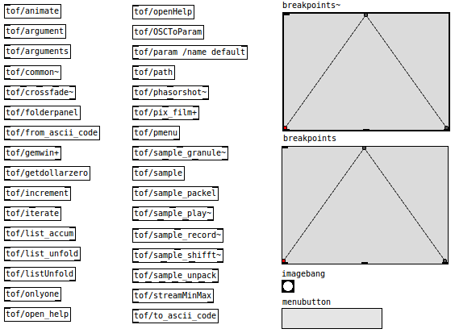

<h2>tof</h2>

Tof is a collection of objects and abstractions covering a wide range in functionality.

This git-fork of the Pure-data library tof is cloned from https://git.puredata.info/cgit/svn2git/libraries/tof.git, 
 which is the svn-to-git from https://sourceforge.net/p/pure-data/svn/HEAD/tree/trunk/externals/tof/.

tof is written by Thomas Ouellet Fredericks around 2009. Thomas allowed me to re-license the library, and the 
 3-clause BSD license seemed most appropriate in the Puredata eco-system. Some objects however are derived from 
 GPL licensed source code.

 

The initial change is replacing the build system by pd-lib-builder. This to simplify creation of a deken package of the libary.

This is version 0.2.2. The next planned version is 0.3.0.

These are the objects in the tof library:
<dl>
<dt>animate</dt>      <dd>abstraction around iemguts/canvasobjectposition</dd>
<dt>argument</dt>     <dd>outputs arguments on bang</dd>
<dt>arguments</dt>    <dd>parses and outputs patch creation arguments on bang</dd>
<dt>breakpoints~</dt> <dd>signal driven graphical envelope table editor / generator (based on ggee/envgen)</dd>
<dt>breakpoints</dt>  <dd>message driven graphical envelope table editor / generator (based on ggee/envgen)</dd>
<dt>common~</dt>      <dd>signal bus object</dd>
<dt>crossfade~</dt>   <dd>multi-channel stereo crossfade</dd>
<dt>folderpanel</dt>  <dd>opens Tk directory selector</dd>
<dt>from_ascii_code</dt> <dd>converts ASCII to messages</dd>
<dt>gemwin+</dt>      <dd>Gem window manager </dd>
<dt>getdollarzero</dt> <dd>get window id of current or parent window (recursive)</dd>
<dt>imagebang</dt>    <dd>GIF based bang</dd>
<dt>increment</dt>    <dd>increments float on bang</dd>
<dt>iterate</dt>      <dd>iterates over range of floats</dd>
<dt>list_accum</dt>   <dd>collects input into a list</dd>
<dt>list_unfold</dt>  <dd>decomposes list into element values and types</dd>
<dt>listUnfold</dt>   <dd>depricated version of list_unfold</dd>
<dt>menubutton</dt>   <dd>drop down menu tool (based on popup by Ben Bogart and button by ggee)</dd>
<dt>onlyone</dt>      <dd>named uniqueness switch</dd>
<dt>open_help</dt>    <dd>arbitrary help patch finder/launcher</dd>
<dt>openHelp</dt>     <dd>depricated version of open_help</dd>
<dt>OSCToParam</dt>   <dd>message forwarder, abstraction based on oscx/dompOSC and maxlib/remote</dd>
<dt>param</dt>        <dd>multi-function object</dd>
<dt>path</dt>         <dd>path utility</dd>
<dt>phasorshot~</dt>  <dd>phasor~ with features</dd>
<dt>pix_film</dt>     <dd>Gem based movie player</dd>
<dt>pmenu</dt>        <dd>pop-up menu tool</dd>
<dt>sample_granule~</dt> <dd>pitchshifting/timestretching sample player</dd>
<dt>sample</dt>       <dd>reads wav file into array</dd>
<dt>sample_packel</dt> <dd>edits array start and end</dd>
<dt>sample_play</dt>  <dd>array sample player</dd>
<dt>sample_record</dt> <dd>writes signal stream to array</dd>
<dt>sample_shift~</dt> <dd>fft based pitchshifting/timestretching sample player</dd>
<dt>sample_unpack</dt> <dd>outputs array meta information and original wav file name</dd>
<dt>streamMinMax</dt> <dd>outputs minimum and maximum of a stream of floats</dd>
<dt>to_ascii_code</dt> <dd>convert message characters to list of floats</dd>
</dl>

Dependencies and derivations:
<ul>
 <li>breakpoints and breakpoints~ are derived from ggee/envgen. Common code in w_breakpoints.h, struct in breakpoints~.h,</li>
 <li>imagebang is derived from ggee/image (the original) and moonlib/image,</li>
 <li>menubutton and pmenu are derived from ggee/button and bbogart/popup,</li>
 <li>param depends on objectlist.h which is based on iemguts/iemguts-objlist.h.</li>
</ul>

moonlib/image, bbogart/popup and iemguts/iemguts-objlist.h are GPL licensed.

For bugs found in this version, please report them to me. Thomas is not responsible for bugs introduced by me.

The original location of this repository is at <a href="https://github.com/electrickery/pd-tof">
 https://github.com/electrickery/pd-tof</a>.

Fred Jan Kraan fjkraan@xs4all.nl 2019-12-26

